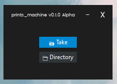
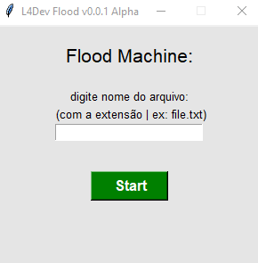
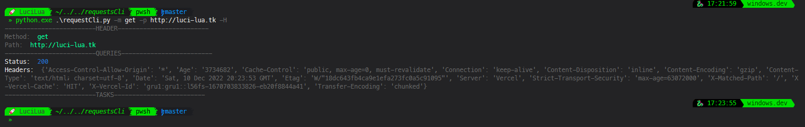

# Python Studies

Some studies in python

1. [take photos](#1-📸-take-photosscreenshots)
2. [flood machine](#2-💬-flood-machine)
3. [CLI: Requests](#3-💻-cli-requests)
4. ...

# 1. 📸 take photos/screenshots

### :octocat: => [Repo](https://github.com/LuciLua/python_studies_1/tree/master/takePhotos)

### How to use

```bash
cd .\takePhotos\
```

```bash
python take.pyw
```

### Preview



<hr/> 

# 2. 💬 Flood machine

### :octocat: => [Repo](https://github.com/LuciLua/python_studies_1/tree/master/flood)

### How to use

```bash
cd .\flood\
```

```bash
python flood.py
```

- Write the name of file (ex.: file.txt)
- Press start
- Wait

### Preview



<hr/>

# 3. 💻 CLI: Requests

### :octocat: => [Repo](https://github.com/LuciLua/python_studies_1/tree/master/requestsCli)

### How to use

```bash
cd .\requestsCli\
```

see all options: 
```bash
python .\requestCli.py -h
```

ex.: 
```bash
python .\requestCli.py -m get -p http://luci-lua.tk -H
```
#### [Output] Preview


