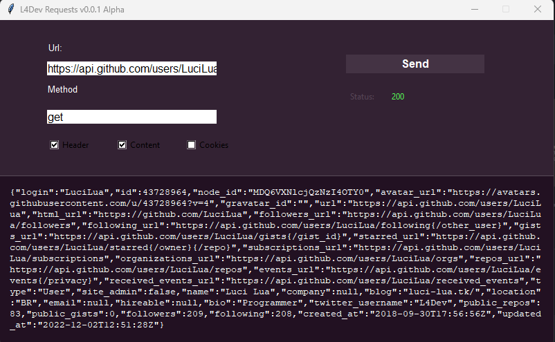
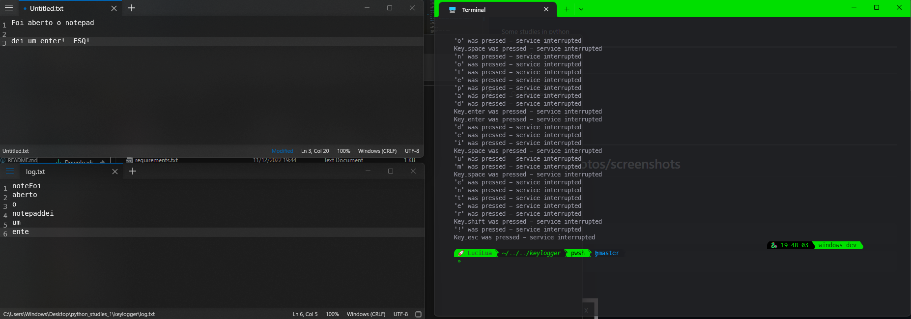

# Python Studies

Some studies in python

---
## Index
- Projects
  - [Take photos](#1📸takephotosscreenshots)
  - [Flood Machine](#2💬floodMachine)
  - [CLI: Requests](#3💻cli-requests)
  - [GUI: Requests](#4💻gui-requests)
  - [Keylogger](#5🖊️keylogger)
---
# 1.📸takePhotosscreenshots

### :octocat: => [Repo](https://github.com/LuciLua/python_studies_1/tree/master/takePhotos)

### How to use

```bash
cd .\takePhotos\
```

```bash
python take.pyw
```

### Preview


--- 

# 2.💬FloodMachine

### :octocat: => [Repo](https://github.com/LuciLua/python_studies_1/tree/master/flood)

### How to use

```bash
cd .\flood\
```

```bash
python flood.py
```

- Write the name of file (ex.: file.txt)
- Press start
- Wait

### Preview


---

# 3.💻CLI-Requests

### :octocat: => [Repo](https://github.com/LuciLua/python_studies_1/tree/master/requestsCli)

### How to use

```bash
cd .\requestsCli\
```

see all options: 
```bash
python .\requestCli.py -h
```

ex.: 
```bash
python .\requestCli.py -m get -p http://luci-lua.tk -H
```
#### [Output] Preview


---

# 4.💻GUI-Requests

### :octocat: => [Repo](https://github.com/LuciLua/python_studies_1/tree/master/requestsGUI)

### How to use

```bash
cd .\requestsGUI\
```

```bash
python .\app.py
```

#### Preview


---

# 5.🖊️Keylogger

### :octocat: => [Repo](https://github.com/LuciLua/python_studies_1/tree/master/keylogger)

### How to use

```bash
cd .\keylogger\
```

```bash
python .\keylog.py
```

> ESQ to exit

> *Log in log .txt*

#### Preview


